# Proyecto de criptografía 2020

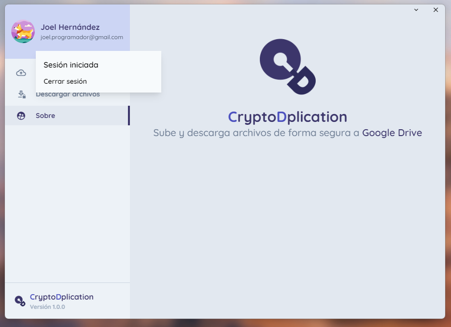

## Problemática

> In a certain company, they have a server to store sensitive information. To keep it secure, every file stored in this server must be encrypted. The CEO have realized that they are storing duplicated files. The company has financial problems, thus it is not possible to buy more servers. Still they need to keep secure the sensitive information, but without duplicates. The CEO has discovered that there is a cryptographic technique to solve this problem, called secure deduplication, but he does not know anything about cryptography.

> Imagine that you have a company that provides security services and designa a software to help the company with the problem.

## Descripción

CryptoDplication es una aplicación multiplataforma que encripta archivos utilizando las llaves RSA que se encuentran en el sistema operativo del usuario y permite guardarlos junto con sus metadatos criptográficos en Google Drive.

## Tecnologías utilizadas

| Tecnología                                                              | Uso                         |
| ----------------------------------------------------------------------- | --------------------------- |
| [React Js](https://reactjs.org/)                                        | UI                          |
| [Tailwind CSS + JIT](https://tailwindcss.com/)                          | UI                          |
| Node Crypto Module                                                      | Encriptación de archivos    |
| [GoogleOAuth2](https://developers.google.com/identity/protocols/oauth2) | Inicio de sesión con Google |
| [Electron JS](https://www.electronjs.org/)                              | Aplicación de escritorio    |

## Uso

Instalar dependencias utilizando Yarn:

```
yarn install
```

Instalar el [servidor de llaves criptográficas](https://github.com/JoelHernandez343/crypto-project-server) y ponerlo en funcionamiento

Iniciar servidor de desarrollo:

```
// Node v17+
npm run dev:n17
// Node >v17
npm run dev
```

## Generando llaves ssh RSA

En el repositorio se incluyen 3 archivos de ejemplo, la clave privada `key`, la clave pública `key.pub` y la clave pública en formato PEM `key.pub.pem`.

**NOTA IMPORTANTE:** Estas llaves incluídas en el repositorio **no son seguras**, solo para demostración.

Para generar claves personales, ejecutar el siguiente comando:

```
ssh-keygen -t rsa -b 1024 -m PEM -f "./key" -N '""' && ssh-keygen -f .\key.pub -e -m pem > key.pub.pem
```

## Establecer llaves

Al establecer las llaves criptográficas de usuario, la aplicación preguntará primero por la llave pública (Elegir `key.pub.pem` o `*.pub.pem`), luego la aplicación pedirá la llave privada (elegir el archivo sin extensión `key`).

## Capturas

Interfaz principal (sin iniciar sesión):

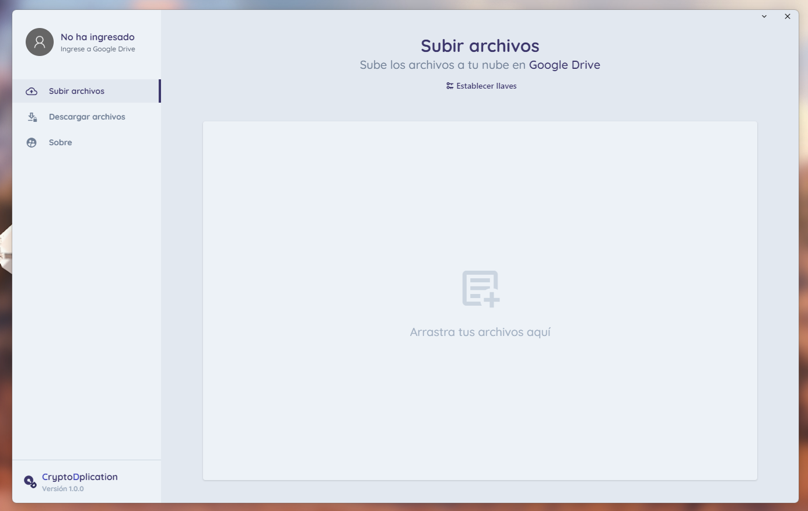

Menú desplegable para iniciar sesión:

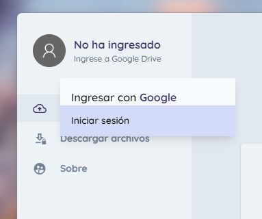

La aplicación automáticamente redirige al navegador para iniciar sesión con Google:

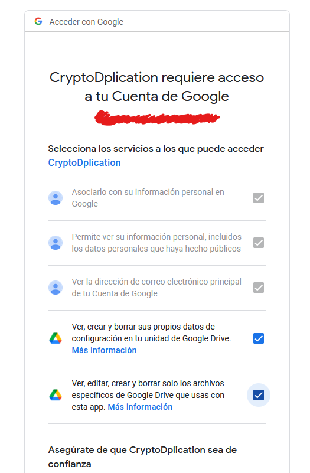

Sesión iniciada (se guarda de forma persistente):

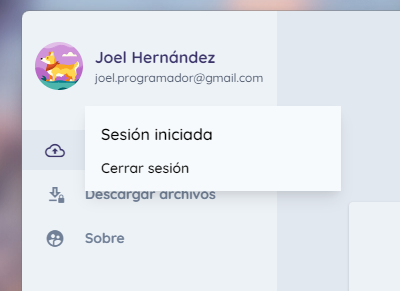

Llaves agregadas exitósamente:

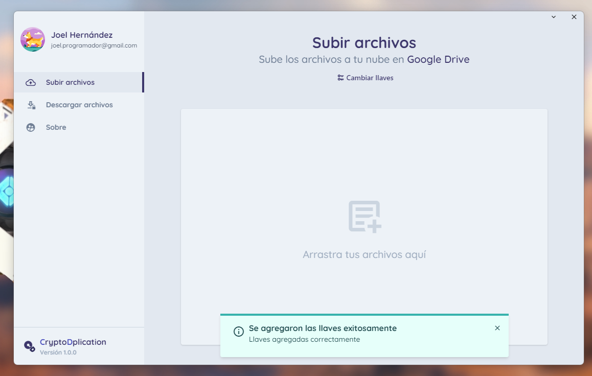

Archivos agregados para encriptar:

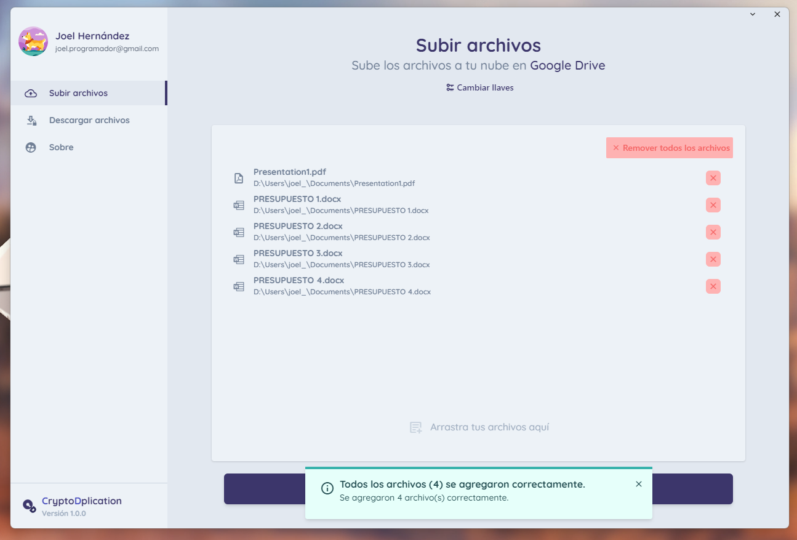

Archivos encriptados en la cola, se pueden agregar más archivos a encriptar o subirlos a la nube:

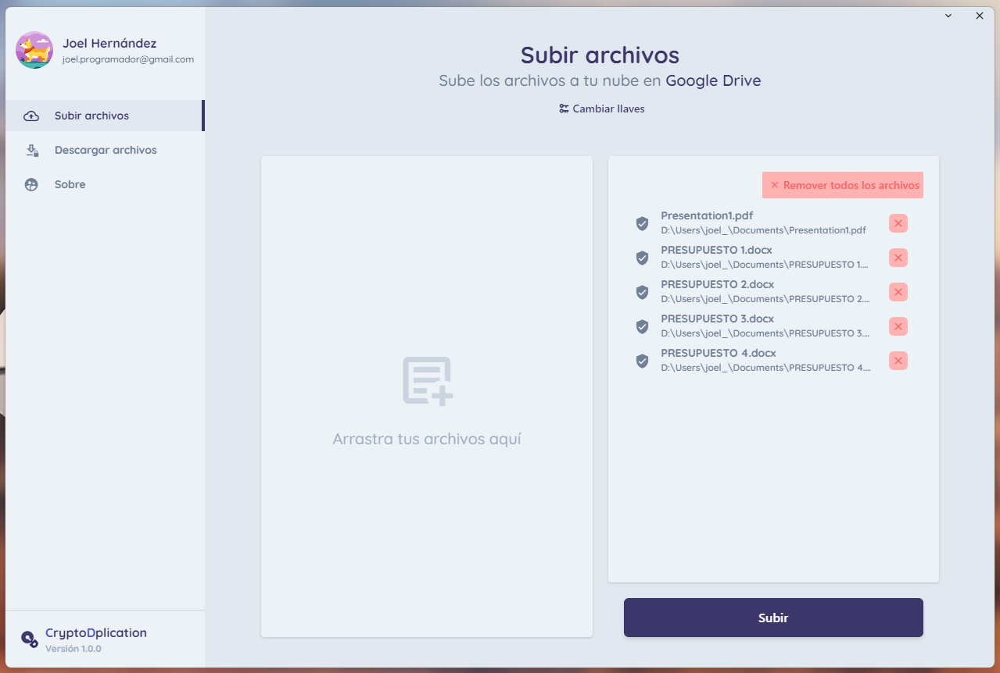

Archivos en proceso de carga:

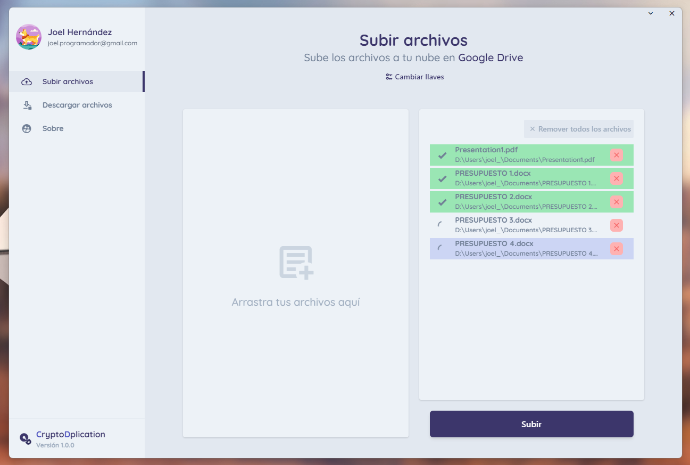

Sección de descargas, aquí se muestran los archivos que se encuentren en la nube del usuario y se permite seleccionar la ruta dónde se van a guardar los archivos:

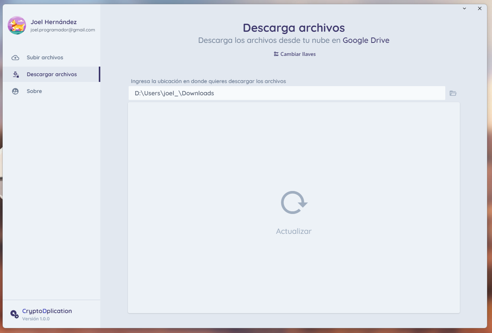

Al actualizar la sección, se muestran los archivos en la nube:

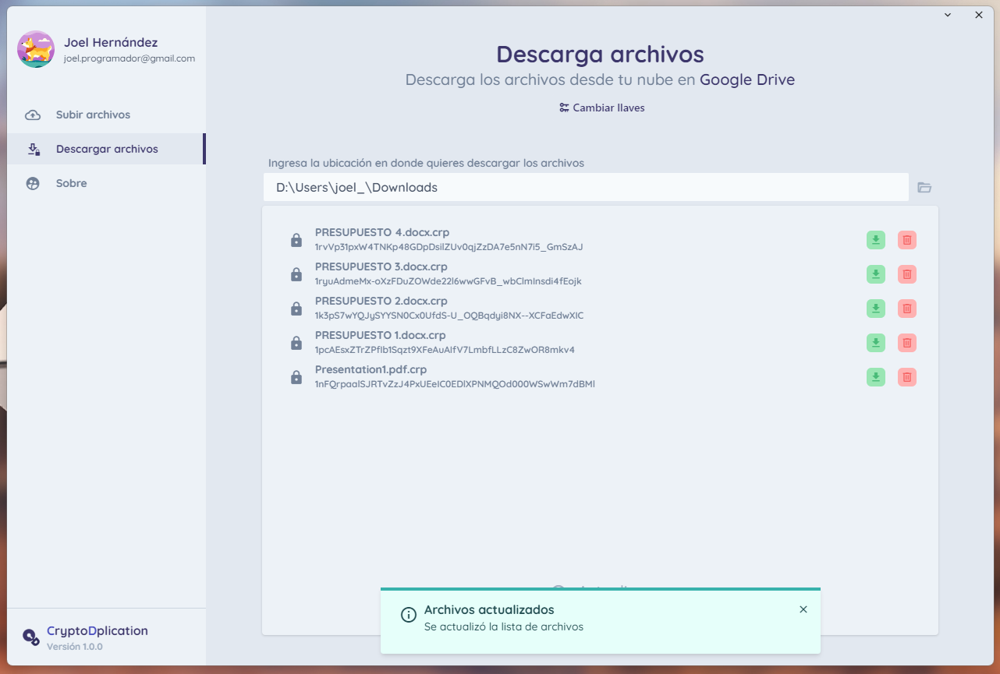

Se pueden descargar los archivos encriptados y automáticamente la aplicación los desencriptará y guardará en la carpeta indicada:

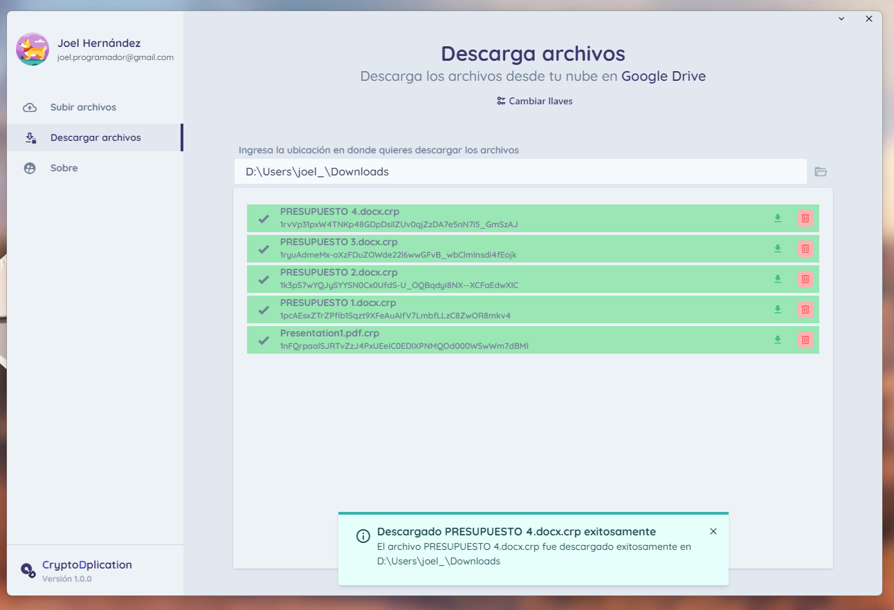
